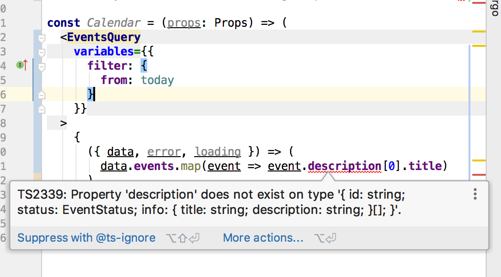
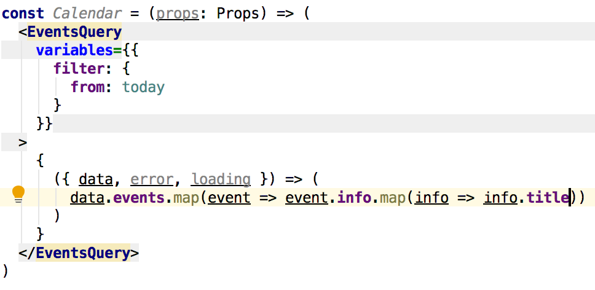
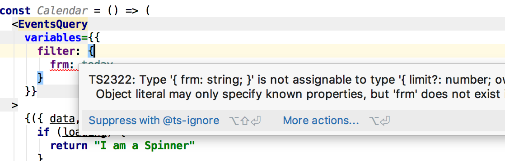

# Using TypeScript to leverage GraphQL's React Apollo

If I could summarize two things that revolutionized the way I write and think about frontend in the last 2 years that it definitely TypeScript and GraphQL. TypeScript is here to fix all the terrible flaws of javascript, and GraphQL is here to fix the terrible way we were collaborating with our teammates on the backend side, over clumsy HTTP requests bound to a fixed URL that returns a some data with absolutely no guarantee on what the data will look like or how consistent this data  a.k.a. REST.

Both these technologies are great, and they have at least two things in common. First common fact is that both TypeScript and GraphQL started coming to light around the same time: In the year 2012 Microsoft made a first release of TypeScript while at the same time GraphQL was developed internally by facebook.

Second common thing is strong typing, a new and very much missed participant in front end development. While typing is a bit demanding at start and its learning curve may be a bit steep, it's worth mastering as the benefits will blow you mind.

The benefits of strong typing in frontend development:

1. You get autocompletion for free. The tooling for TypeScript is already quite amazing. You get autocomplete everywhere, even inside your JSX uhmm... I mean of course TSX !!
2. Change your queries and refactoring your code is a breeze. If for any reason you had to change something in your data structure, instead of code just breaking, TypeScript will mark red all the places in your code that needs a change too. Across all files in your project. For a JavaScript developer, this is a joy!
3. No need to write as many unit tests as before. And no everyone's going to agree with me here, but it seems to me that like 90% of the code we write is just glue: Pass that data here, show this there, submit that form here. If you type everything in your app and use trusted tools like apollo and formik, you will only have to test the stuff which makes your app special, your own custom and complex logic. For many other cases, TypeScript will break your build before you will break the application.




## Reality proof patterns you won't regret

In the following section I will present some of the patterns that evolved in front of my eyes in the during year, as I was building many feature that relied heavily on data fetching, creation and editing. 

### The Query Component supercharged with TypeScript
We'll start in the beginning, fetching and mutating the data. TS Style.

First of all, the imports:

```tsx
import {Query} from 'react-apollo'
import gql from 'graphql-tag'
```

Nothing exciting here. Let's continue with the query itself:

```graphql
const query = gql`
    query EventsQuery($filter: EventsQueryFilter!) {
        events(filter: $filter) {
            id
            status
            info {
                title
                description
            }
        }
```

Same here, just plain old GQL. If you don't see what's going on here, [you should go and cover some GraphQL basics.](http://link)

Now we can start adding types to both our data and variables:

```tsx
interface Variables {
    filter: GQL.EvensQueryFilter
}
export interface EventData {
  id: string
  status: string
  info: Array<{
    title: string
    description: string
  }>
}
interface Data {
  events: EventData[]
}
```

The first input type `GQL.EvensQueryFilter` can be auto generated using [gql2ts](https://github.com/avantcredit/gql2ts) or another tool. For the query itself, I don't know about a tool that can parse a query and generate the resulting TypeScript. It should be possible though and if not already existing, we can count on it being available sometime soon.

Now to the cool part, where we create a Query component:

```
export default class EventsQuery extends Query<Data, Variables> {
  static defaultProps = {
    query
  }
}
```

Using [generics](https://www.typescriptlang.org/docs/handbook/generics.html) we are adding super-powers to our Query component. This will help us a lot when using the query within our application, as I will be demonstrating below. As a nice addition, I've set the query as a default property so we don't need to set it again when implementing the actual feature.

Now let's take a look at this `EventsQuery` component in action:

```tsx
const Calendar = () => (
  <EventsQuery
    variables={{
      filter: {
        from: today
      }
    }}
  >
    {({ data, error, loading }) => {
      if (loading) {
        return "I am a Spinner"
      }
      if (error) {
        return error.message
      }

      return data.events.map(event => <Event event={event} />)
    }}
  </EventsQuery>
)
```

What do we gain here? In the query level we are mostly benefiting from typo protection and auto completion. For example if I misspelled something, TypeScript will let me know:


But that's not all yet! See how the data fetching part is separated from the actual view? If you pay attention you'll see there is not even a single DOM element produced here. Not a single div. We are simple passing data downwards to visual components that will generate the actual DOM for us. In this case an Event component will tell us something about the event data we just fetched from the API:

```tsx
import * as React from 'react'
import {EventData} from "./EventsQuery"

interface Props {
  event: EventData
}

const Event = (props: Props) => (
  <div>
    <h1> {props.event.info[0].title} </h1>
    <p> {props.event.info[0].description} </p>
  </div>
)

export default Event
```

Can you see what's going on here? Did it make a click? Or you as much excited as I am?

Just because we are separating data fetching components from view components, that doesn't mean we have to walk blind, nor duplicate our Props interface. If you payed attention in the EventsQuery component, I've exported the EventData. If you didn't, then it's maybe time to scroll up and come back.

# Welcome Back !

By now you should understand how to use the Query's typing in the visual components. Cool. Now since our code is nice and DRY, adding more data, or renaming it just in one place will propagate the types automatically to our visual component. Let's say we want to extend our query to fetch the description's language:

Into our query we will add the language field:

```gql
    info {
        title
        description
        language # <-- we add this
    }
```

And not forget the only manual step that we have to do (until tooling will improve), and extends our EventType interface

```
export interface EventData {
  id: string
  status: string
  info: Array<{
    title: string
    description: string
    language: string // <-- we add this
  }>
}
```

Now language will be available to our display component without any further offers. Any other component that uses data from this query will also benefit from the exported data type. Being a JS developer in 2019 is just great:

Now that I have the language field I can choose to show a description in a given language:

```
const Event = (props: Props) => {
  // Get desired language or fallback to first language
  const localInfo = props.language
    ? props.event.info.find(info => info.language === props.language)
    : props.event.info[0]
  return (
    <div>
      <h1> {localInfo.title} </h1>
      <p> {localInfo.description} </p>
    </div>
  )
}
export default Event
```